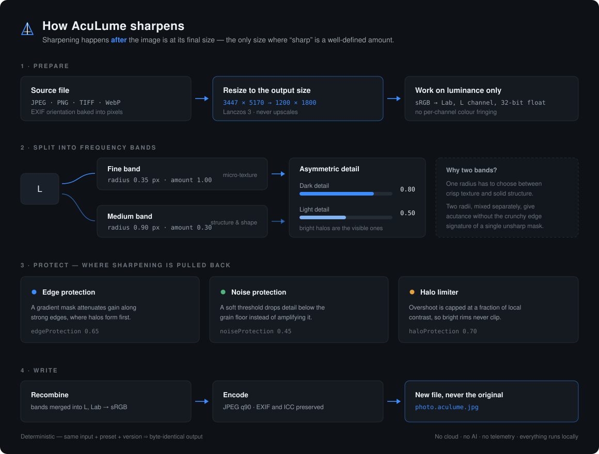
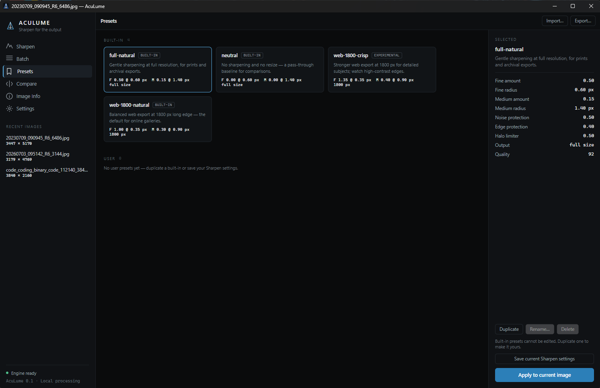

<div align="center">


# AcuLume

**Output-aware adaptive sharpening for photographers.**
Local, deterministic, no cloud, no AI — a desktop app and a CLI over one engine.

`.NET 10` · `Avalonia 12` · `libvips` · Windows x64, Linux x64

</div>

---

Every sharpening tool asks *how much*. AcuLume first asks **at what size**. A 1:1 setting that
looks perfect on a 45-megapixel master turns to mush at 1800 px on the web, because downscaling
throws away exactly the detail the sharpening was built on. AcuLume resizes first and sharpens the
pixels that will actually be published — then keeps halos, noise, and edge crunch under explicit
control instead of hoping a single radius gets it right.

## How it works



The pipeline in one paragraph: the image is decoded with EXIF orientation baked in, resized to the
final output size with Lanczos 3, and converted to Lab so only the **L** channel is touched — colour
never fringes. L is split into a **fine** and a **medium** frequency band, each with its own radius
and amount, and each band's **dark** and **light** halves are scaled separately (the Photoshop
Lighten/Darken trick, made continuous). Three guards then pull the gain back: an **edge mask** where
halos form first, a **soft noise threshold** below the grain floor, and a **halo limiter** that caps
overshoot at a fraction of local contrast instead of clipping. The bands are merged back into L, the
image returns to sRGB, and a new file is written — the source is never overwritten.

Full algorithm write-up: [`docs/ALGORITHM.md`](docs/ALGORITHM.md). Canonical specification:
[`docs/AcuLume_IMPLEMENTATION_REQUIREMENTS.md`](docs/AcuLume_IMPLEMENTATION_REQUIREMENTS.md).

## The desktop app



Six screens over the same `AcuLume.Core` engine the CLI uses, so what the preview shows is what the
export writes — previews render at the **output** resolution, because that is the resolution the
sharpening is tuned for, and they are colour-managed into the monitor's own ICC profile so a
wide-gamut display does not show everything oversaturated.

| Screen | What it does |
|---|---|
| **Sharpen** | Live preview with before / after / split view, zoom at fit · 100% · 200%, every parameter as a slider, one-click export |
| **Batch** | Queue files or a folder, one preset, progress and cancel |
| **Presets** | Built-in presets plus your own library under `%APPDATA%/AcuLume/presets`, import / export / duplicate / rename / delete |
| **Compare** | The five-variant set — original, resize-only, USM baseline, AcuLume natural, AcuLume crisp — side by side |
| **Image Info** | File, capture (EXIF) and the exact output maths for the current settings |
| **Settings** | Engine, libvips version, the display profile in use, paths, keyboard shortcuts |

```bash
dotnet run --project src/AcuLume.Gui              # open empty
dotnet run --project src/AcuLume.Gui -- photo.jpg # open an image straight away
```

## Install

Grab `AcuLume-win-Setup.exe` from the [latest release](https://github.com/Diddlik/AcuLume/releases)
and run it — the build is self-contained, so nothing else needs to be installed. `AcuLume-win-Portable.zip`
is the same build as an unpack-and-run folder. Both carry the GUI and the `aculume` CLI.

An installed copy updates itself from GitHub: **Settings → Updates → Check for updates**. Nothing is
checked or downloaded unless you press the button, and this is the only time the app touches the
network at all.

## Build from source

- .NET 10 SDK (pinned in `global.json`)
- Nothing else — libvips ships with the `NetVips.Native` packages

```bash
dotnet build
dotnet test
```

To produce a release locally (installer, portable zip and update feed in `build/releases`):

```powershell
dotnet tool restore
./build/publish-windows.ps1 -Version 0.2.0
```

Pushing a `v*` tag runs the same script in CI and publishes the artifacts to a GitHub release. The
version has to match the tag, because that is what the in-app updater compares against.

## The CLI

```bash
# What am I working with?
dotnet run --project src/AcuLume.Cli -- info photo.jpg

# Sharpen for a 1800 px web export
dotnet run --project src/AcuLume.Cli -- sharpen photo.jpg \
  --preset web-1800-natural --output photo.web.jpg

# Any preset value can be overridden; the flag always wins
dotnet run --project src/AcuLume.Cli -- sharpen photo.jpg \
  --preset web-1800-natural --fine-amount 6.5 --halo-protection 0.8
```

Source files are never overwritten: `--output` must differ from the input, and when it is omitted
the tool writes `<name>.aculume<ext>` next to the input.

### Parameters

| Flag | Meaning |
|---|---|
| `--preset <name\|path>` | Built-in preset name or a path to a preset JSON file |
| `--long-edge <px>`, `--allow-upscale` | Output size; upscaling is off by default |
| `--capture-sharpen <off\|low\|normal>` | Light restoration before the resize (spec section 21); off by default |
| `--capture-engine <finerestore\|richardsonlucy>`, `--capture-radius`, `--capture-iterations` | Which restoration engine and its parameters; Richardson-Lucy is experimental |
| `--resize-strategy <single\|staged>`, `--resize-space <gamma\|linearlight>` | Experimental resize research (spec Phase 3); defaults are `single` and `gamma` |
| `--quality <1-100>` | JPEG quality |
| `--fine-radius`, `--fine-amount` | Fine band — micro-texture |
| `--medium-radius`, `--medium-amount` | Medium band — structure and shape |
| `--darken`, `--lighten` | Asymmetric dark / light detail scaling |
| `--edge-protection`, `--edge-threshold`, `--edge-softness`, `--edge-blur` | Edge mask |
| `--noise-protection`, `--noise-threshold`, `--noise-softness` | Soft noise threshold |
| `--halo-protection`, `--halo-window`, `--halo-dark-limit`, `--halo-light-limit` | Halo limiter |

### Presets

| Preset | For |
|---|---|
| `web-1800-natural` | Balanced 1800 px web export — the default for online galleries |
| `web-1800-crisp` | Stronger 1800 px export for detailed subjects (experimental — watch high-contrast edges) |
| `full-natural` | Gentle sharpening at full resolution, for prints and archival exports |
| `neutral` | No sharpening, no resize — the pass-through baseline for comparisons |

Presets are versioned JSON with strict validation: a malformed value is rejected, never silently
clamped.

```bash
dotnet run --project src/AcuLume.Cli -- preset list
dotnet run --project src/AcuLume.Cli -- preset show web-1800-natural
dotnet run --project src/AcuLume.Cli -- preset validate my-preset.json
```

### Comparing quality

`compare` writes the five variants side by side, optionally with fixed crop regions repeated across
every variant for pixel-level inspection:

```bash
dotnet run --project src/AcuLume.Cli -- compare photo.jpg --output ./compare \
  --crop edge=1200,800,300,300 --crop foliage=2000,1500,300,300
```

### Exit codes

| Code | Meaning | Code | Meaning |
|---|---|---|---|
| 0 | success | 4 | unsupported format |
| 1 | general processing error | 5 | invalid preset |
| 2 | invalid command or options | 6 | output conflict |
| 3 | input not found or inaccessible | 7 | cancelled |

## Project layout

```text
src/AcuLume.Core/     engine — imaging, sharpening stages, presets, comparison
src/AcuLume.Cli/      thin CLI adapter
src/AcuLume.Gui/      thin Avalonia adapter (MVVM)
tests/                xUnit tests per project
presets/              built-in preset JSON
docs/                 specification, algorithm write-up, images
```

`AcuLume.Core` never references an adapter, and neither adapter reimplements pipeline maths — that
is what keeps the GUI preview and a CLI export in agreement.

## Guarantees

- **Deterministic.** Same input + preset + version ⇒ the same output, every run. No randomness.
- **Local.** No network access, no upload, no telemetry, no external API.
- **Non-destructive.** The source file is never written to.
- **Precise.** All internal maths in 32-bit float on luminance, never independent RGB channels.

## Status

Phase 1 of the specification is complete — the full adaptive multi-frequency pipeline, presets,
`compare`, and the desktop app. Next up:

- **Phase 2 — calibration.** Presets calibrated against 200 photographs from two camera bodies:
  `web-1800-natural` overshoots ~31% less per unit of sharpening than a reference unsharp mask, in 79
  of 80 photographs, and pushes ~20x fewer pixels into clipping (method and numbers in
  [`docs/ALGORITHM.md`](docs/ALGORITHM.md)). `web-1800-crisp` stays experimental: it amplifies fine
  texture hardest, which on a subject carrying sensor moiré amplifies the moiré too.
- **Phase 3 — resize research.** Done, with a negative result: staged downscaling and linear-light
  resampling were implemented, measured against an ideal FFT downscale, and neither earns a default
  change — libvips already shrinks in stages internally, and the moiré turned out to come from the
  camera sensor, not the resize.
- **Phase 4 — done, also a negative result.** Capture sharpening (`--capture-sharpen off|low|normal`)
  and Richardson-Lucy deconvolution are implemented and off by default: measured against simply
  turning the output stage up to the same acutance, both cost more halo, and Richardson-Lucy costs
  ~9x the processing time. Deconvolution needs a PSF that a demosaiced, already-sharpened JPEG cannot
  supply, so Wiener was not built for the same reason.
- **Phase 5 — distribution.** Windows x64 done: self-contained publish, Velopack installer and
  portable zip, and in-app updates from GitHub releases. Linux x64 packaging is still open, as is
  code signing — installers are currently unsigned, so Windows SmartScreen will warn on first run.
